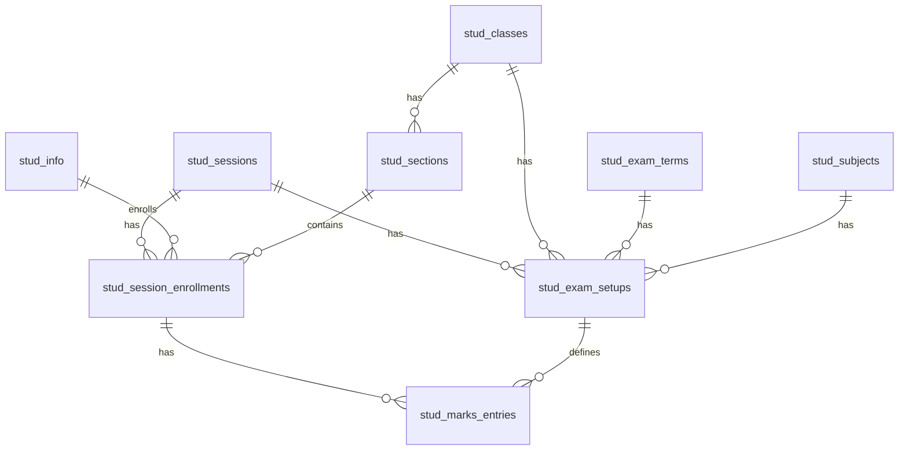

# Darpan

A modern, high-performance **school management web application** built with **SvelteKit**, **Tailwind CSS v4**, and **[Better-Auth](https://better-auth.com/)**. Darpan streamlines student records, exam configuration, and marks entry — all behind a secure, role-based dashboard.

The application uses a local **LibSQL/SQLite** database via **Drizzle ORM**, and includes robust authentication with email verification, password reset, and Role-Based Access Control (RBAC) tailored for restricted staff access.

## ✨ Features

### Authentication & Access Control
- **Role-Based Access Control (RBAC)**: Manage user roles (`staff`, `admin`) with session-based access.
- **Restricted Staff Registration**: Only pre-authorized staff (verified against the `allowed_staff` table) can create accounts.
- **Email Verification**: Nodemailer integration with `better-auth` to mandate email verification before account activation.
- **Password Management**: Complete "Forgot Password" and password reset flows.

### School Management
- **Student Registry**: Searchable student records with filtering by session, class, and section. Paginated results with portal ID, roll number, class, and parent details.
- **Exam Setup**: Admin panel to configure subjects per exam — set full marks, pass marks, sort order, and marksheet inclusion for each session/class/term combination.
- **Marks Entry**: Real-time marks entry with auto-save on blur. Features include:
  - Cascading dropdowns (Session → Class → Section → Term → Subject)
  - "Mark All Present" toggle
  - Auto-validation: marks exceeding full marks are highlighted red and blocked from saving
  - Failed students (below pass marks) are highlighted in amber
  - Live status indicators (student count, present count, failed count)
- **Staff Data Entry**: Staff members can fill out and update their employment details.

### UI & Developer Experience
- **Premium Dark UI**: Glassmorphism cards, indigo accent system, smooth transitions, and micro-animations.
- **Svelte 5 Runes**: Modern reactive state management with `$state`, `$derived`, and `$effect`.
- **Server Queries**: Type-safe remote functions using SvelteKit's `query()` API with Valibot validation.

## 🚀 Tech Stack

| Layer | Technology |
|---|---|
| **Framework** | [SvelteKit](https://kit.svelte.dev/) (Svelte 5) with Node adapter |
| **Styling** | Tailwind CSS v4 with `@tailwindcss/forms` |
| **Authentication** | `better-auth` with RBAC plugin |
| **Database** | LibSQL (local SQLite) via `@libsql/client` |
| **ORM** | Drizzle ORM with Drizzle Kit |
| **Validation** | Valibot |
| **Email** | Nodemailer |
| **Tooling** | Vite, TypeScript, ESLint, Prettier, pnpm |

## 📂 Project Structure

```text
src/
├── lib/
│   ├── config.ts                  # App-wide constants (APP_NAME)
│   └── server/
│       ├── auth.ts                # Better-Auth config (plugins, RBAC)
│       ├── auth-utils.ts          # Auth helper utilities
│       ├── email.ts               # Nodemailer configuration
│       └── db/
│           ├── index.ts           # Drizzle client (LibSQL + WAL mode)
│           └── schema/
│               ├── auth.ts        # Auth tables (user, session, account)
│               ├── staff.ts       # Staff employment table
│               ├── marksheet.ts   # Core schema: classes, sessions, sections,
│               │                  #   subjects, exam setups, enrollments, marks
│               └── relations.ts   # Drizzle relation definitions
├── routes/
│   ├── (app)/dashboard/
│   │   ├── +page.svelte           # Dashboard with quick-action cards
│   │   ├── students/              # Student registry (list + detail)
│   │   │   ├── students.remote.ts # Server queries for filtering
│   │   │   └── [id]/              # Individual student detail page
│   │   ├── staff-entry/           # Staff data entry form
│   │   └── admin/                 # Admin-only routes (role-guarded)
│   │       ├── allowed-staff/     # Manage authorized staff list
│   │       ├── exam-setup/        # Configure exam subjects & marks
│   │       │   └── setup.remote.ts
│   │       └── marks-entry/       # Enter student marks per exam
│   │           └── marks-entry.remote.ts
│   ├── login/                     # Login page
│   ├── register/                  # Restricted registration
│   ├── forgot-password/           # Password reset flow
│   ├── about/                     # About page
│   └── api/                       # API routes (auth handlers)
```

## 🗄️ Database Schema



**Key tables**: `stud_info` (students), `stud_session_enrollments` (class/section/roll per year), `stud_exam_setups` (subject config per exam), `stud_marks_entries` (individual marks with presence tracking).

## 🛠️ Getting Started

### 1. Prerequisites

- **Node.js** v20+ recommended
- **pnpm** installed globally (`npm i -g pnpm`)
- No external database server required (uses local LibSQL/SQLite)

### 2. Environment Variables

Create a `.env` file in the project root:

```env
# Database
DATABASE_URL="file:./sqlite.db"

# Better Auth
BETTER_AUTH_SECRET="your-strong-random-secret"
BETTER_AUTH_URL="http://localhost:5173"

# Email (Nodemailer)
EMAIL_USER="your-email@example.com"
EMAIL_PASSWORD="your-email-password"
```

### 3. Install & Setup

```bash
# Install dependencies
pnpm install

# Push schema to SQLite database
pnpm db:push

# (Optional) Sync Better-Auth schema with Drizzle
pnpm auth:schema

# (Optional) Open Drizzle Studio to inspect the DB
pnpm db:studio
```

### 4. Development

```bash
pnpm dev
```

Visit `http://localhost:5173` to access the application.

### 5. Type Checking

```bash
pnpm check
```

## 🚢 Deployment

This project uses `@sveltejs/adapter-node`. To build for production:

```bash
pnpm build
```

Start the server using the generated entry point in the `build/` directory.

## 📜 Available Scripts

| Script | Description |
|---|---|
| `pnpm dev` | Start the Vite dev server |
| `pnpm build` | Build for production |
| `pnpm check` | Run Svelte & TypeScript checks |
| `pnpm lint` | Run ESLint & Prettier checks |
| `pnpm format` | Auto-format with Prettier |
| `pnpm db:push` | Push Drizzle schema to database |
| `pnpm db:generate` | Generate Drizzle migrations |
| `pnpm db:studio` | Open Drizzle Studio GUI |
| `pnpm auth:schema` | Sync Better-Auth schema to Drizzle |
